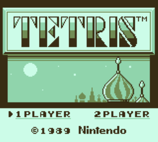
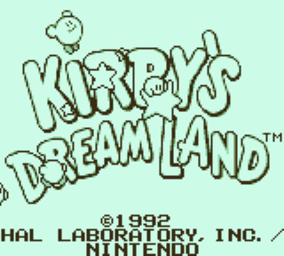
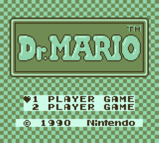
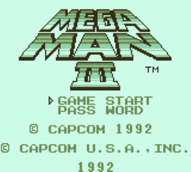
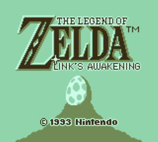

# Zigboy

This is a hobby project of mine to learn the [Zig programming language](https://ziglang.org/). It is a GameBoy (DMG) emulator.

## Tasks

- [x] CPU
- [x] MMU
- [x] PPU
- [x] Timer
- [x] MBC1
- [ ] MBC2
- [ ] MBC5
- [ ] Save/load states
- [ ] Audio
- [ ] Debugger
    - [ ] Disassembly
    - [ ] Breakpoints
    - [ ] Visualizations
- [ ] CGB Support

## Screenshots

## Building & Running
This project uses Zig 14.1.

You can just run `zig build run -Doptimize=ReleaseSafe` or `zig build run -Doptimize=ReleaseSafe -- .\path\to\rom.gb`

## References
[Pandocs](https://gbdev.io/pandocs)

[GBZ80](https://rgbds.gbdev.io/docs/v0.9.3/gbz80.7)

[Game Boy: Complete Technical Reference](https://gekkio.fi/files/gb-docs/gbctr.pdf)